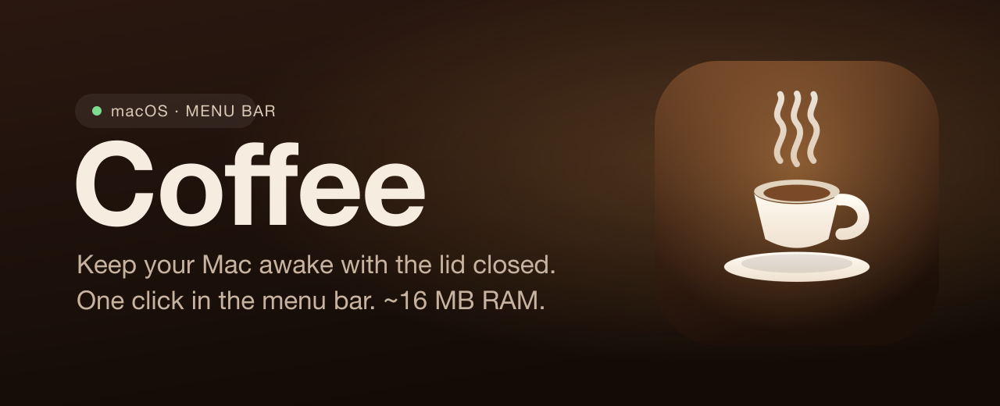
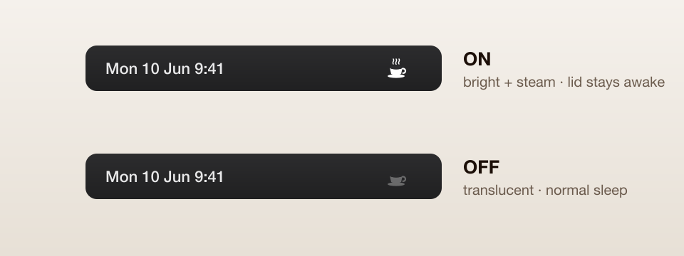

<h1 align="center">Coffee</h1>

<p align="center">
  <em>Keep your Mac awake with the lid closed — one click in the menu bar.</em>
</p>

<p align="center">
  
  
  <a href="https://github.com/pehqge/coffee/releases/latest"></a>
  <a href="LICENSE"></a>
  
</p>

<p align="center">
  
</p>

---

**Coffee** is a tiny native macOS menu-bar app that toggles a single system
setting: whether your Mac keeps running when you close the lid. Useful when you
want background jobs, downloads, agents, or a server to keep going while the
laptop is shut and tucked away.

One click on the cup flips it. The icon always reflects the **real** system
state — even if you change it from the terminal — because it reads live from
`pmset`. It launches at login, weighs about **16 MB** of memory, and does
nothing else.

<p align="center">
  
</p>

## Why

- **One click** — left-click the cup to enable/disable. Right-click for a small menu.
- **Always truthful** — reads live state from `pmset` every few seconds, so external changes show up too.
- **Featherweight** — native Swift / AppKit, ~16 MB resident, no background CPU.
- **Starts at login** — installs its own `LaunchAgent` the first time it runs.
- **Scoped & safe** — the only privileged thing it does is `pmset -a disablesleep 0|1`, via a narrowly-scoped passwordless `sudo` rule it helps you install once.

---

## Install

1. **Download** [`Coffee.zip`](https://github.com/pehqge/coffee/releases/latest/download/Coffee.zip) from the [latest release](https://github.com/pehqge/coffee/releases/latest).
2. Unzip and drag **Coffee.app** into your **Applications** folder.
3. The app is open-source and signed ad-hoc (not notarized), so macOS quarantines it on download. Clear that once:
   ```bash
   xattr -dr com.apple.quarantine /Applications/Coffee.app
   ```
   > Prefer clicking? Double-click the app, then go to **System Settings → Privacy & Security → Open Anyway**.
4. Open **Coffee.app**. A cup appears in your menu bar (top-right).

### One-time permission

Changing the lid setting needs `root`. On first launch Coffee detects it has no
permission, **copies the exact setup command to your clipboard**, and shows you
a dialog. Just:

1. Click **Open Terminal** in the dialog.
2. Paste (**⌘V**), press **Return**, and type your Mac password **once**.

That writes a `sudoers` rule allowing *only* `pmset -a disablesleep 0|1` without
a password — nothing else. After that, toggling is instant. You can re-trigger
this anytime from the right-click menu → **Setup permission…**

---

## Usage

- **Left-click** the cup → toggle on/off.
  - **ON** → bright cup with steam. Mac stays awake with the lid closed (battery *and* power).
  - **OFF** → translucent cup. Normal sleep behavior.
- **Right-click** → status, Enable/Disable, Setup, Quit.

> Heads-up: running with the lid closed means no airflow, so the Mac runs hotter,
> and the battery drains faster since the display and CPU stay active.

---

## Build from source

Requires the Xcode Command Line Tools (`xcode-select --install`).

```bash
git clone https://github.com/pehqge/coffee
cd coffee
./build.sh          # compiles, bundles the icon, signs → ./Coffee.app
```

The whole app is a single Swift file: [`src/main.swift`](src/main.swift).

---

## How it works

- The setting is `pmset -a disablesleep` (`1` = stay awake with lid closed, `0` = normal). `SleepDisabled` in `pmset -g` is the source of truth.
- Coffee reads that value on a light 10-second timer (with tolerance, so it's effectively free) and on every click.
- Toggling runs `sudo -n /usr/bin/pmset -a disablesleep 0|1`, permitted without a password by `/etc/sudoers.d/coffee-lid`, scoped to exactly those two commands.
- Autostart is a user `LaunchAgent` at `~/Library/LaunchAgents/com.pedro.coffeelid.plist`, which the app writes itself if missing.

## Uninstall

```bash
launchctl bootout gui/$(id -u)/com.pedro.coffeelid
rm -rf /Applications/Coffee.app ~/Library/LaunchAgents/com.pedro.coffeelid.plist
sudo rm -f /etc/sudoers.d/coffee-lid
```

---

## License

[Apache 2.0](LICENSE) © Pedro Gimenez
